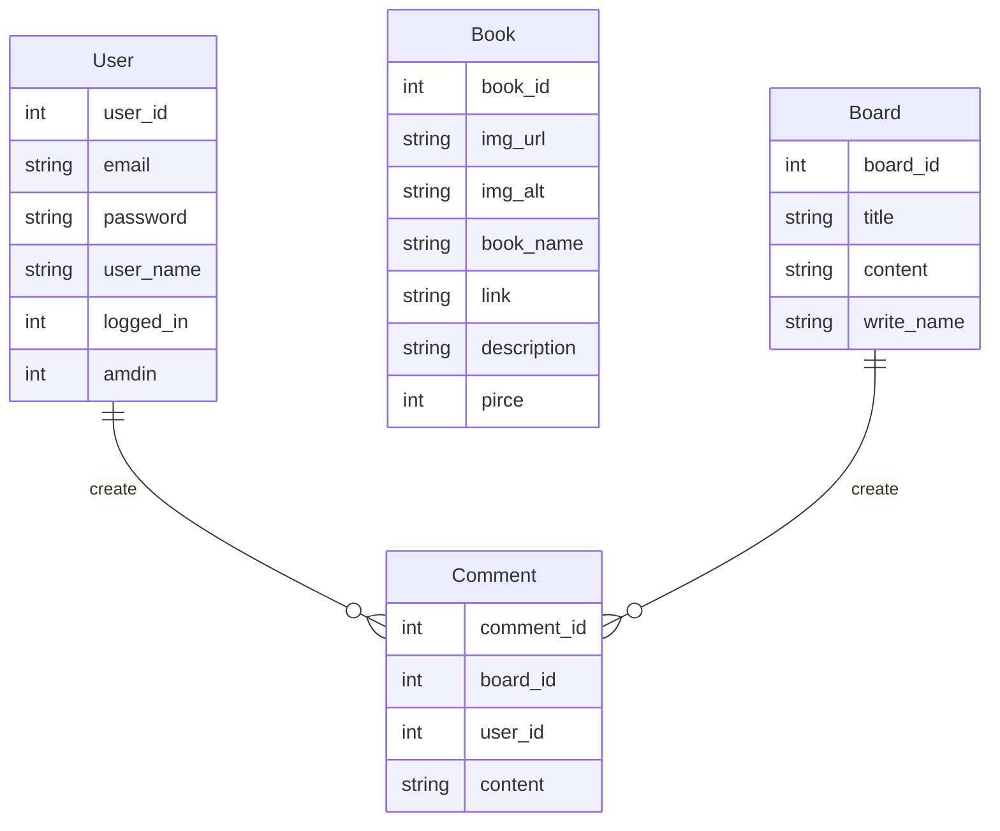
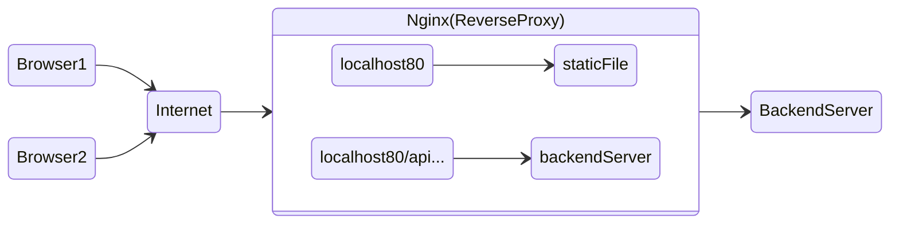

# Web Project - dohyeong

교재 개발을 하는 친구를 위한 웹 프로젝트, 자기 PR 웹 사이트

 

## 요구 사항

1. 자기 소개를 할 수 있는 프로필 화면
2. 만든 교재를 홍보하고 구매하러 갈 수 있는 화면
3. 학생들과 소통할 수 있는 게시판

 

## 필요한 기능

- 유저
    
    회원 가입(o)
    로그인, 로그아웃(o)
    회원 정보 수정(x)
    회원 탈퇴(x)
    
- 교재
    
    (관리자만)
    교재 등록(x)
    등록한 교재 삭제(x)
    교재 수정(x)
    
- 게시판
    
    (관리자만)
    게시글 생성(x)
    게시글 삭제(x)
    게시글 수정(x)
    
- 댓글
    
    게시글에 작성(x)
    관리자만 댓글 삭제 가능(x)
    대댓글(x)
    
 

## ERD

관리자만이 교재와 게시글을 생성, 수정, 삭제할 수 있는 상황에서, 사용자(User)와 게시판(Board), 그리고 사용자(User)와 교재(Book) 간의 참조 관계를 설정하지 않았습니다.

 

## 개발

### Frontend

***React 버전 6 사용***

- Home 컴포넌트: 자기소개 페이지
- Book 컴포넌트: 교재 리스트를 보여줄 페이지
- Board 컴포넌트: 학생들과 소통할 수 있는 페이지 (x)
- Navigation 컴포넌트: 페이지 이동을 위한 상단 메뉴(Link를 통한 SSR)
- modalwindows 컴포넌트: 로그인 및 회원가입을 위한 모달 윈도우
- …

 
 

### Backend

***Gin 프레임워크, MySql 사용***

**GET**

- 백엔드는 모든 책 정보를 프론트엔드로 전달한다.
- …

**POST**

- 프론트엔드는 백엔드로 사용자 정보를 보내고 로그인하거나 신규 가입한다.
- 프론트엔드는 백엔드로 책 정보를 보내고 추가한다. (x)
- …

**DELETE**

- 프론트엔드는 백엔드로 특정 책 정보를 보내고 삭제한다. (x)
- 프론트엔드는 백엔드로 로그아웃을 요청한다.
- …

 
 

### Nginx

 

## 배포

1. **Dockerfile 이미지 빌드 방법 작성**
    - 프로젝트 디렉토리 내에 Dockerfile 작성.
    - 필요한 패키지, 의존성 및 실행 환경을 정의하여 Docker 이미지를 빌드할 수 있도록 설정.
2. **GitAction을 이용한 Docker 이미지 빌드**:
    - GitHub 레포지토리에 GitAction workflow 설정.
    - 레포지토리에 새로운 코드가 push되면 GitAction을 활용하여 Docker 이미지 빌드.
    - 빌드된 이미지를 Docker Hub 저장소에 push하여 저장.
3. **프로그램 실행 서버에 배포**:
    - Docker 이미지를 실행할 서버에 접속.
    - Docker 이미지를 실행하여 프로그램을 배포.

 

## 개발 참고용) R**eact-router-dom 버전 6 패키지 바뀐점**

- exact 옵션 삭제
- 컴포넌트 렌더링 component, render 속성 네이밍 -> Component, element로 변경
- URL Params 읽는 법(match객체) -> useParams() 사용
- Query 읽는 법(location객체) -> useLocation() 사용
- useHistory(), 리다이렉트 -> useNavigate() 사용
- Link to 속성 -> to, state로 나눠서 사용
