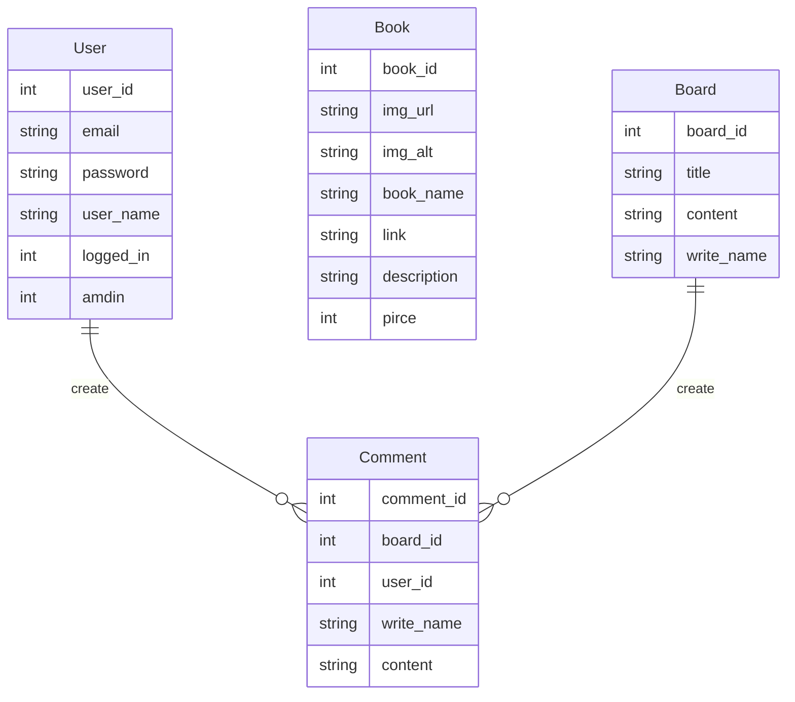
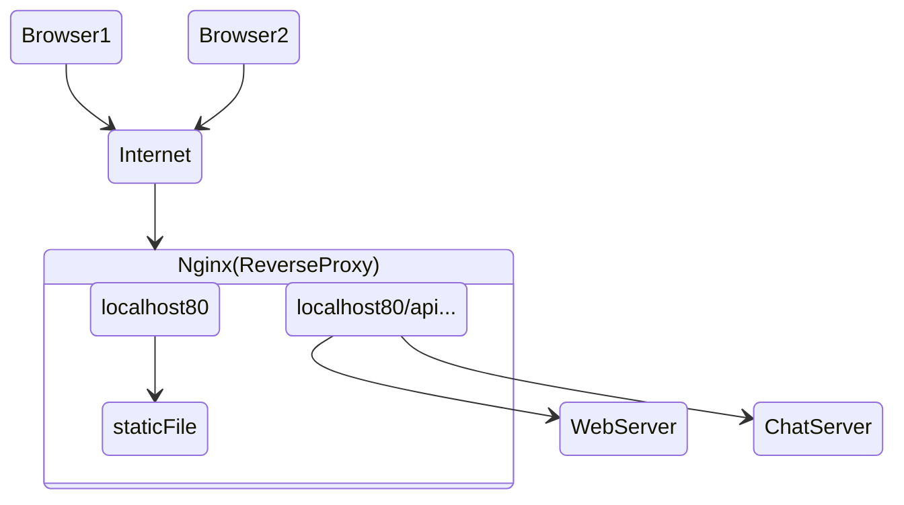
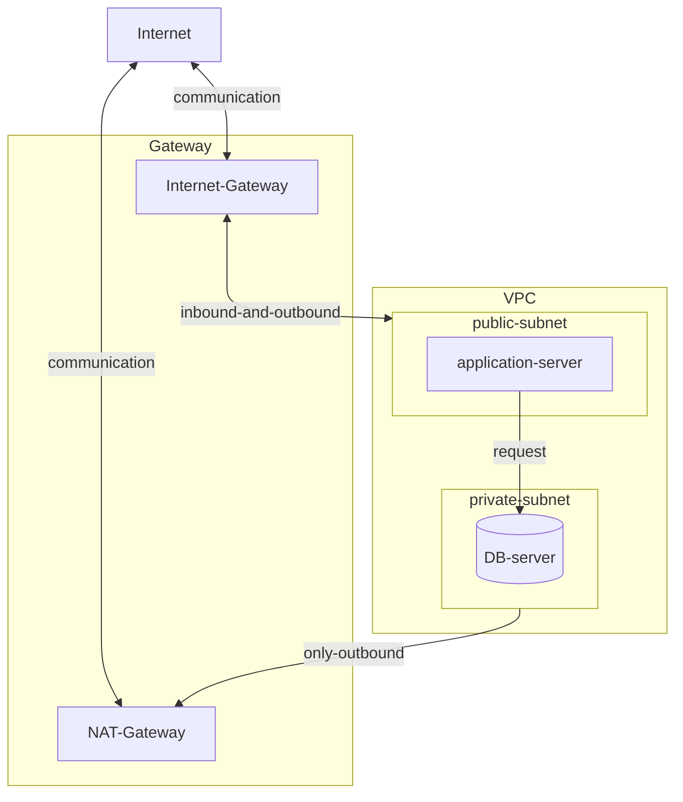

# Web Project - [dohyeong](http://175.45.205.116/)

교재 개발을 하는 친구를 위한 웹 프로젝트, 자기 PR 웹 사이트

 

## 요구 사항

1. 자기 소개를 할 수 있는 프로필 화면
2. 만든 교재를 홍보하고 구매하러 갈 수 있는 화면
3. 학생들과 소통할 수 있는 게시판

 

## 필요한 기능

- 유저
  회원 가입(o)
  로그인, 로그아웃(o)
  회원 정보 수정(x)
  회원 탈퇴(x)
- 교재
  (관리자만)
  교재 등록(x)
  등록한 교재 삭제(x)
  교재 수정(x)
- 게시판
  (관리자만)
  게시글 생성(o)
  게시글 삭제(o)
  게시글 수정(x)
- 댓글
  게시글에 작성(o)
  관리자만 댓글 삭제 가능(o)
  대댓글(x)

 

## ERD

관리자만이 교재와 게시글을 생성, 수정, 삭제할 수 있는 상황에서, 사용자(User)와 게시판(Board), 그리고 사용자(User)와 교재(Book) 간의 참조 관계를 설정하지 않았습니다.

 

## 개발

### Frontend

**_React 버전 6 사용_**

- Home 컴포넌트: 자기소개 페이지
- Book 컴포넌트: 교재 리스트를 보여줄 페이지
- Board 컴포넌트: 게시글 목록과 게시글 상세 내용을 보여줄 페이지
- Navigation 컴포넌트: 페이지 이동을 위한 상단 메뉴(Link를 통한 CSR)
- modalwindows 컴포넌트: 로그인 및 회원가입을 위한 모달 윈도우
- FormBoard 컴포넌트: 게시글 생성을 위한 입력 폼
- WebSocket 컴포넌트: 채팅방 페이지
- …

 
 

### Backend

**_Gin 프레임워크, MySql 사용_**

**GET**

- 백엔드는 모든 책 정보를 프론트엔드로 전달한다.
- 백엔드는 모든 게시글 목록을 프론트엔드로 전달한다.
- 벡엔드는 특정 게시글을 프론트엔드로 전달한다.
- 백엔드는 채팅을 위한 웹 소켓 연결을 하고, 데이터를 송/수신한다.[chat-server](https://github.com/Jaeun-Choi98/web-socket-project)
- …

**POST**

- 프론트엔드는 백엔드로 사용자 정보를 보내고 로그인하거나 신규 가입한다.
- 프론트엔드는 백엔드로 책 정보를 보내고 추가한다. (x)
- 프론트엔드는 백엔드로 게시글 정보를 보내고 추가한다.
- …

**DELETE**

- 프론트엔드는 백엔드로 특정 책 정보를 보내고 삭제한다. (x)
- 프론트엔드는 백엔드로 로그아웃을 요청한다.
- 프론트엔드는 백엔드로 특정 게시글 정보를 보내고 삭제한다.
- …

 
 

### Nginx

 
 

## 서버

네이버 클라우드 VPC 서비스를 활용하여 서버를 구축했습니다. 네이버 클라우드 VPC는 직접 네트워크를 설계할 수 있어 서버 구축이 더 유연해집니다. private subnet에서는 사설망 내의 서버만 통신이 가능하기 때문에, SSL VPN 서비스를 이용하거나 public subnet 서버에 접속한 후에 private subnet 서버에 접속하는 방법 등을 활용해야 합니다. 또는 private subnet 서버에 새 NIC를 할당하여 public subnet에 바인딩하여 공인 IP를 받는 방법(제 생각이라 틀린 방법일 수도 있습니다.)도 고려할 수 있습니다. 개발 시 불편함을 줄이기 위해 현재는 public subnet에 또 다른 DB 서버를 생성하고 공인 IP를 할당하여 개발 및 배포 중에 있습니다.

 

## 배포

1. **Dockerfile 이미지 빌드 방법 작성**
   - 프로젝트 디렉토리 내에 Dockerfile 작성.
   - 필요한 패키지, 의존성 및 실행 환경을 정의하여 Docker 이미지를 빌드할 수 있도록 설정.
2. **GitAction을 이용한 Docker 이미지 빌드**:
   - GitHub 레포지토리에 GitAction workflow 설정.
   - 레포지토리에 새로운 코드가 push되면 GitAction을 활용하여 Docker 이미지 빌드.
   - 빌드된 이미지를 Docker Hub 저장소에 push하여 저장.
3. **프로그램 실행 서버에 배포**:
   - Docker 이미지를 실행할 서버에 접속.
   - Docker 이미지를 실행하여 프로그램을 배포.

 

## 개발 참고용) R**eact-router-dom 버전 6 패키지 바뀐점**

- exact 옵션 삭제
- 컴포넌트 렌더링 component, render 속성 네이밍 -> Component, element로 변경
- URL Params 읽는 법(match객체) -> useParams() 사용
- Query 읽는 법(location객체) -> useLocation() 사용
- useHistory(), 리다이렉트 -> useNavigate() 사용
- Link to 속성 -> to, state로 나눠서 사용
